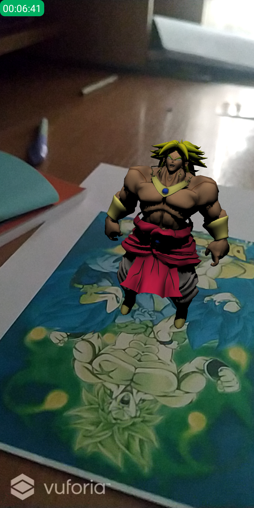
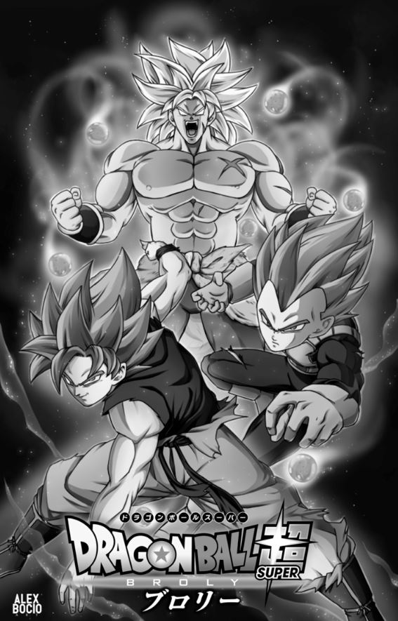

# UnityARBrolyHelloWorld
First assignment in the Mixed Realities course of UAIC Faculty of ComputerScience

Create a image target with Vuforia and instantiate a character model that animates when you approach it.

Used image target:

